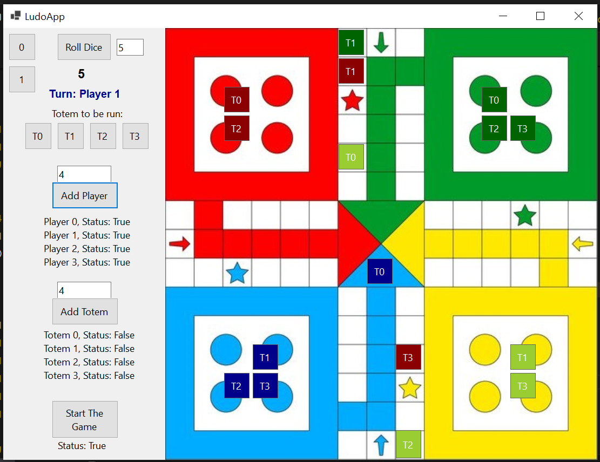

# LudoGame

This repository is part of The Bootcamp project of Formulatrix Software Engineering, at Formulatrix Company, Salatiga City, Indonesia.

## Table of Contents
- [Progress Update]()
- [Repository Foldering Structure]()
- [Game Features]()
- [Issues]()
- [Board Coordinate Scheme]()
- [How to Use]()
- [References]()

### Progress Update


### Repository Foldering Structure
```
LudoGame
├── Game
├── GameObject
├── LudoObjects
├── Utility
LudoGameGUI
└── bin
   └── Debug
      └── net8.0-windows
          └── LudoGameGUI.exe   
```

### Game Features
- Support for 2-4 players
- Provide a simple graphical user interface to be played around
- Support specific Ludo rules: 
    - Got number six: the same player holds
    - Collision rule: 
    - Specific path/route of play for each player    

### Issues (To be solved soon)
- Collision rule
- Got number six: the same player holds
- No need to choose Totem if there is no totem OnPlay (dice != 6)

### Board Coordinate Scheme
This library is built based on the following board coordinate scheme.


### How to Use
- Clone the repo: 

    ``` 
    git clone https://github.com/yudharisandy/LudoGame.git 
    ```

- Instanciate ```LudoGameScene```.

    ``` 
    var _ludoGameScene = new LudoGameScene(); 
    ```

- Register Players: Here is the example of block code to register player in your interface. Firstly, you need to specified ``` int numberOfPlyers```.

    ```
    for (int i = 0; i < numberOfPlayers; i++)
    {
        LudoPlayer _ludoPlayer = new(i);
        bool status = _ludoGameScene.ludoContext.RegisterPlayers(_ludoPlayer);
    }
    ```

- Register totems: Here is the example of block code to register totem to each player. Firstly, you need to specify ``` int numberOfTotems```.

    ```
    foreach(var player in _ludoGameScene.ludoContext._players){
        List<Totem> totemsList = new();
        for (int i = 0; i < numberOfTotems; i++)
        {
            Totem _totem = new(i);
            totemsList.Add(_totem);
        }
        bool status = _ludoGameScene.ludoContext.RegisterTotems(player, totemsList);
    }
    ```

- Roll dice.

    ``` 
    int diceValue = _ludoGameScene.ludoContext.dice.Roll(); 
    ```

- Run the game: Here is the example of block code to run the game.

    ```
    while(true){
        // Loop for every player
        foreach(var player in _ludoGameScene.ludoContext._playerTotems){
            
            rollDiceClickedTask = new TaskCompletionSource<bool>();
            await rollDiceClickedTask.Task;
            
            chooseTotemToMove = new TaskCompletionSource<bool>();
            await chooseTotemToMove.Task;
            
            _ludoGameScene.NextTurn(player.Key, player.Value, diceValue, userInputTotemID);

            // ... method to update each totems position in your interface

            await Task.Delay(1000);
        }
    }
    ```

### References
- [Class Diagram](https://github.com/probabilitynokami/ClassDiagram/blob/main/Ludo.md)
- [Formulatrix Bootcamp Repository](https://github.com/yudharisandy/Bootcamp-Formulatrix-CSharp)