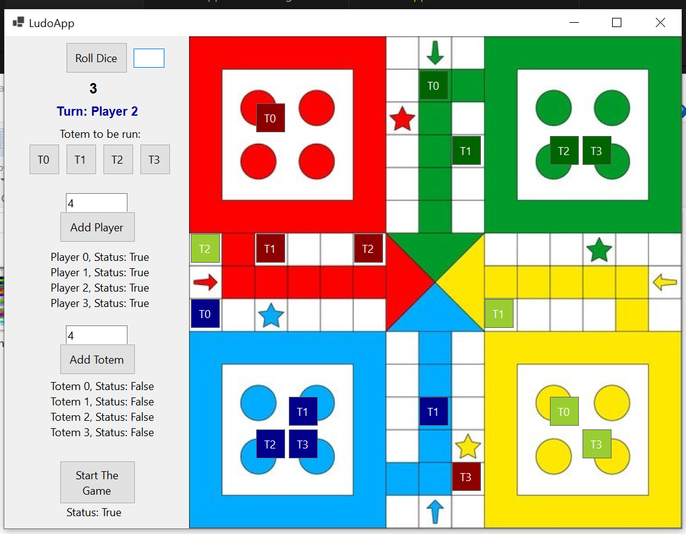
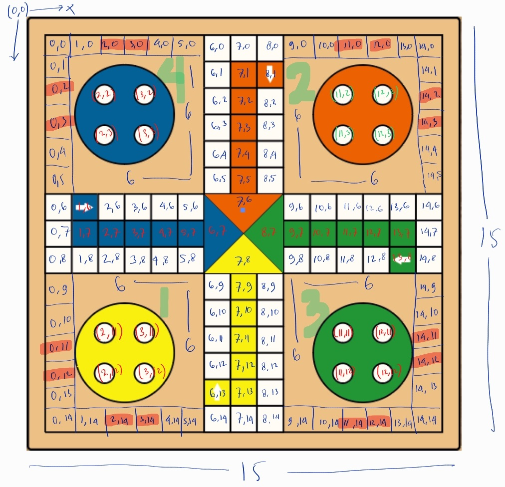

# LudoGame

This repo is a library for Ludo Game, a strategy board game for two to four players, in which the players race their four tokens from start to finish according to the rolls of a single dice, 100% written in C#. [Read more](https://en.wikipedia.org/wiki/Ludo#:~:text=Ludo%20%28%2F%20%CB%88lju%CB%90do%CA%8A%20%2F%3B%20from%20Latin%20ludo%20%27,is%20derived%20from%20the%20Indian%20game%20Pachisi.%20).

This repo is an individual project of The Bootcamp of Formulatrix Software Engineering, at Formulatrix Company, Salatiga City, Indonesia.

## Table of Contents
- [GUI Example]()
- [Repository Foldering Structure]()
- [Game Features]()
- [Issues]()
- [Board Coordinate Scheme]()
- [Ludo Paths]()
- [How to Use]()
- [Methods Explaination]()
- [References]()

## Graphical User Interface (GUI) Example
The following is the example of a GUI built using Windwos Forms Apps.


## Repository Foldering Structure
```
LudoGame
├── Game
├── GameObject
├── LudoObjects
├── Utility
LudoGameGUI
└── bin
   └── Debug
      └── net8.0-windows
          └── LudoGameGUI.exe   
```

## Game Features
- Support for 2-4 players
- Provide a simple graphical user interface to be played around
- Support specific Ludo rules: 
    - The totem can only go out when dice value is 6
    - No need to choose Totem if there is no totem OnPlay (dice != 6)
    - Got number six: the same player holds
    - Collision rule: Send enemy's totem back to the home position.
    - Specific path/route of play for each player/totem.
    - Method to choose the winner and stop the game.    

## Next Plan
- Library: When a totem reach the final cell -> the same player holds.
- GUI: GUI for handling the collision rule update.
    - GUI Bug: A kicked Totem doesn't automatically go back to Home when it is choosen to move in the next turn.

## Board Coordinate Scheme
This library is built based on the following board coordinate scheme.


## Ludo Paths
The following is the scheme of the ludo paths.

[Image source](https://en.wikipedia.org/wiki/Ludo#:~:text=Ludo%20%28%2F%20%CB%88lju%CB%90do%CA%8A%20%2F%3B%20from%20Latin%20ludo%20%27,is%20derived%20from%20the%20Indian%20game%20Pachisi.%20)

## How to Use
- Clone the repo: 

    ``` 
    git clone https://github.com/yudharisandy/LudoGame.git 
    ```

- Instanciate ```LudoGameScene```.

    ``` 
    var _ludoGameScene = new LudoGameScene(); 
    ```

- Register Players: Here is the example of block code to register player in your interface. Firstly, you need to specify ``` int numberOfPlyers```.

    ```
    for (int i = 0; i < numberOfPlayers; i++)
    {
        LudoPlayer _ludoPlayer = new(i);
        bool status = _ludoGameScene.ludoContext.RegisterPlayers(_ludoPlayer);
    }
    ```

- Register totems: Here is the example of block code to register totem to each player. Firstly, you need to specify ``` int numberOfTotems```.

    ```
    foreach(var player in _ludoGameScene.ludoContext._players){
        List<Totem> totemsList = new();
        for (int i = 0; i < numberOfTotems; i++)
        {
            Totem _totem = new(i);
            totemsList.Add(_totem);
        }
        bool status = _ludoGameScene.ludoContext.RegisterTotems(player, totemsList);
    }
    ```

- Roll dice.

    ``` 
    int diceValue = _ludoGameScene.ludoContext.dice.Roll(); 
    ```

- Run the game: Here is the example of block code to run the game.

    ```
    while (true)
    {
        // Loop for every player
        foreach (var player in _ludoGameScene.ludoContext._playerTotems)
        {
            do {
                // Player turn
                System.Console.WriteLine($"Turn: Player {player.Key.ID + 1}");

                // Roll dice
                int diceValue = _ludoGameScene.ludoContext.dice.Roll(); 
                // ... method to control/wait/show the diceValue in your UI

                // Choose totem to be moved
                System.Console.Write("Totem to be moved: ");
                string userInputTotemIDString = Console.ReadLine();
                int.TryParse(userInputTotemIDString, out userInputTotemID);

                _ludoGameScene.NextTurn(player.Key, player.Value, diceValue, userInputTotemID);

                // ... method to check the winner

                // ... method to update each totems position in your UI

            } while (diceValue == 6);
        }
    }
    ```

- Choose the winner: You can add the following block code in your run-loop.

    ```
    _gameStatus = _ludoGameScene.GetGameStatus(player.Key, player.Value[userInputTotemID]);
    if (_gameStatus == false){
        _playerTurnLabel.Text = $"Player {player.Key.ID + 1} Win!";
        _startLabel.Text += $"Status: {_gameStatus}";
        
        // ... method to stop the game;
        await Task.Delay(100000);
    }
    ```

## Methods Explaination


## References
- [Class Diagram](https://github.com/probabilitynokami/ClassDiagram/blob/main/Ludo.md)
- [Formulatrix Bootcamp Repository](https://github.com/yudharisandy/Bootcamp-Formulatrix-CSharp)