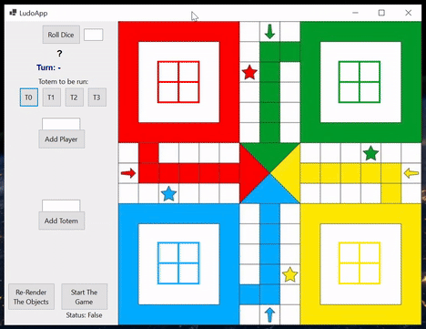

# LudoGame

This repo is a library for Ludo Game, a strategy board game for two to four players, in which the players race their four tokens from start to finish according to the rolls of a single dice, 100% written in C#. [Read more](https://en.wikipedia.org/wiki/Ludo#:~:text=Ludo%20%28%2F%20%CB%88lju%CB%90do%CA%8A%20%2F%3B%20from%20Latin%20ludo%20%27,is%20derived%20from%20the%20Indian%20game%20Pachisi.%20).

This repo is an individual project of The Bootcamp of Formulatrix Software Engineering, at Formulatrix Company, Salatiga City, Indonesia.

## Table of Contents
- [GUI Example]()
- [Repository Foldering Structure]()
- [Game Features]()
- [Issues]()
- [Board Coordinate Scheme]()
- [Ludo Paths]()
- [How to Use]()
- [Methods Explaination]()
- [License]()
- [References]()

## Graphical User Interface (GUI) Example
The following is the example of a GUI built using Windwos Forms Apps.


## Repository Foldering Structure
```
LudoGame
├── Game
├── GameObject
├── LudoObjects
├── Utility
LudoGameGUI
└── bin
   └── Debug
      └── net8.0-windows
          └── LudoGameGUI.exe   
```

## Game Features
- Support for 2-4 players
- Support specific Ludo rules: 
    - The totem can only go out when dice value is 6
    - No need to choose Totem if there is no totem OnPlay (dice != 6)
    - Got number six: the same player holds
    - Collision rule: Send enemy's totem back to the home position.
    - Specific path/route of play for each player/totem.
    - Method to choose the winner and stop the game.    
    - When a player kick other player's totem -> the same player holds.
    - When a totem reach the final cell -> the same player holds.
    - When a totem reach a final cell -> be able to run other totem when got non-6 dice.
    - When there is only 1 totem OnPlay -> directly move the totem (user doesn't need to choose the totem)
- Provide a playground interface to be tried out!
    - GUI: A kicked Totem automatically go back to ```HomePosition``` when collision happens.
    - GUI: Re-Render the objects button -> To show all totems in correct position.

## Next Plans
- Library: when totem kicked out (when player accidentally click the kicked out totem -> the player just remain the same -> continue to next player)


## Board Coordinate Scheme
This library is built based on the following board coordinate scheme.


## Ludo Paths
The following is the scheme of the ludo paths.

[Image source](https://en.wikipedia.org/wiki/Ludo#:~:text=Ludo%20%28%2F%20%CB%88lju%CB%90do%CA%8A%20%2F%3B%20from%20Latin%20ludo%20%27,is%20derived%20from%20the%20Indian%20game%20Pachisi.%20)

## How to Use
- Clone the repo: 

    ``` 
    git clone https://github.com/yudharisandy/LudoGame.git 
    ```

- Instanciate ```LudoGameScene```.

    ``` 
    var _ludoGameScene = new LudoGameScene(); 
    ```

- Register Players: Here is the example of block code to register player in your interface. Firstly, you need to specify ``` int numberOfPlyers```.

    ```
    for (int i = 0; i < numberOfPlayers; i++)
    {
        LudoPlayer _ludoPlayer = new(i);
        bool status = _ludoGameScene.ludoContext.RegisterPlayers(_ludoPlayer);
    }
    ```

- Register totems: Here is the example of block code to register totem to each player. Firstly, you need to specify ``` int numberOfTotems```.

    ```
    foreach(var player in _ludoGameScene.ludoContext._players){
        List<Totem> totemsList = new();
        for (int i = 0; i < numberOfTotems; i++)
        {
            Totem _totem = new(i);
            totemsList.Add(_totem);
        }
        bool status = _ludoGameScene.ludoContext.RegisterTotems(player, totemsList);
    }
    ```

- Roll the dice.

    ``` 
    int diceValue = _ludoGameScene.ludoContext.dice.Roll(); 
    ```

- Run the game: Here is the example of block code to run the game in your ```./Program.cs```.

    ```
    while (true)
    {
        // Loop for every player
        foreach (var player in _ludoGameScene.ludoContext._playerTotems)
        {
            do {
                // Player turn
                System.Console.WriteLine($"Turn: Player {player.Key.ID + 1}");

                // Roll dice
                int diceValue = _ludoGameScene.ludoContext.dice.Roll(); 
                // ... method to control/wait/show the diceValue in your UI

                // Choose totem to be moved
                System.Console.Write("Totem to be moved: ");
                string userInputTotemIDString = Console.ReadLine();
                int.TryParse(userInputTotemIDString, out userInputTotemID);

                _ludoGameScene.NextTurn(player.Key, player.Value, diceValue, userInputTotemID);

                // ... method to check and update _getCollisionStatus

                // ... method to check _gameStatus, for getting the winner

                // ... method to check _getTotemReachFinalCellStatus

                // ... method to update each totems position in your UI

            } while (diceValue == 6 || _getTotemReachFinalCellStatus == true || _getCollisionStatus == true);
        }
    }
    ```

- Choose the winner: You can add the following block code in your run-loop.

    ```
    _gameStatus = _ludoGameScene.GetGameStatus(player.Key, player.Value[userInputTotemID]);
    if (_gameStatus == false){
        _playerTurnLabel.Text = $"Player {player.Key.ID + 1} Win!";
        
        // ... method to stop the game;
        await Task.Delay(100000);
    }
    ```

- The same player holds if his/her totem reach the final cell. You can add the following block code in your run-loop, then add to your ```while``` condition requirements.

    ```
    // Check whether the totem reach the final cell or not
    // If true: the same player holds.
    _getTotemReachFinalCellStatus = _ludoGameScene.GetTotemReachFinalCellStatus(player.Value[userInputTotemID]);
    ```

- The same player holds if there is a collision. You can add the following block code in your run-loop, then add to your ```while``` condition requirements.

    ```
    // Check whether there is collision or not
    _getCollisionStatus = _ludoGameScene.GetCollisionStatus(); // true: collision | false: no collision
    ```

- To choose automatically the totem when there is only one OnPlay totem. You can add the following block code example in your run-loop,

    ```
    // If there is only 1 OnPlay totem, user doesn't need to choose anymore.
    if (numberTotemOnPlay == 1 && diceValue != 6){
        // method to get that one totem ID
        // When get dice 6, user can choose themselves
        userInputTotemID = GetTheOnlyOnPlayTotemID(player.Value);
    }
    else{
        chooseTotemToMove = new TaskCompletionSource<bool>();
        await chooseTotemToMove.Task; // Wait player to choose one totem to change "userinputTotemID" (0-3)
    }
    ```

    ```
    private int GetTheOnlyOnPlayTotemID(List<Totem> totemLists){
        // A method to get the only one OnPlay Totem ID, called only when there is one OnPlay Totem
        int id = 0;
        foreach(var totem in totemLists){
            if(totem.totemStatus == TotemStatus.OnPlay){
                id = totem.ID;
            }
        }
        return id;
    }
    ```

- To update the scene based on collision. The following block code is an example, can be put in the run-loop method.

    ```
    private void CollisionSceneUpdate(){
        if (_getCollisionStatus == true){
            // Get totemToBeKicked
            var totemToBeKicked = _ludoGameScene.GetTotemToBeKicked();
            var playerToBeKicked = _ludoGameScene.GetPlayerToBeKicked();

            // RemoveTotem from working cell
            RemoveTotem(totemToBeKicked.PreviousPosition.x, totemToBeKicked.PreviousPosition.y);

            // MoveTotem to Home Position
            Color colorToBeKicked = SetTotemColor(playerToBeKicked);
            MoveTotem(totemToBeKicked.HomePosition.x, 
                    totemToBeKicked.HomePosition.y, 
                    totemToBeKicked, 
                    colorToBeKicked);
        }
    }
    ```

- For more details, please refer to ```./LudoGameGUI/Attributes/LudoApplication.OnGame.cs```.

## Methods Explaination


## License
- The repo is licensed under the MIT license.


## References
- [Class Diagram](https://github.com/probabilitynokami/ClassDiagram/blob/main/Ludo.md)
- [Formulatrix Bootcamp Repository](https://github.com/yudharisandy/Bootcamp-Formulatrix-CSharp)